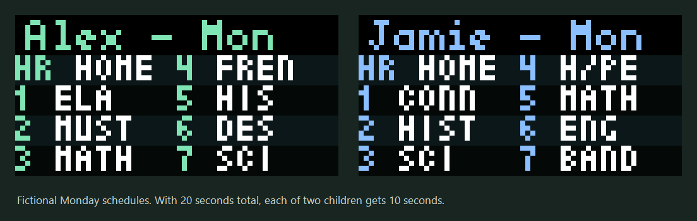

# Family Schedule for Tronbyt

A native Tronbyt app that displays children's daily Infinite Campus schedules
on a 64×32 Tidbyt. Everything runs on your Tronbyt server; no separate computer
or background service is required after installation.

Each child gets an equal share of the configured display time, with their name and weekday above a
two-column list of period labels and class abbreviations. It shows up to eight
classes per screen, filling top to bottom, then left to right in two equal-width,
left-aligned columns, with extra pages for longer days. Non-school days show
“No classes.” Times are used for ordering, but are not displayed.



*Illustrative screens with fictional names. Classes read down the left column,
then down the right column. The app alternates between children
every ten seconds when Display Time Seconds is 20 and there are two children.*

## Requirements

- A running [Tronbyt server](https://github.com/tronbyt/server) and a configured
  64×32 device.
- An Infinite Campus **Parent** account using a direct username/password login.
- Your district's Campus base URL, district app name, and school timezone.
- Python 3.10+ only if you use the optional installer. No Python packages needed.

This is an unofficial integration using Campus portal endpoints, not a supported
Infinite Campus API. It has been tested with one district. District configuration
and portal changes may affect compatibility. SSO, MFA, and CAPTCHA login flows
are not supported.

## Install through Tronbyt

1. In your device's **Add App** page, upload
   [`tronbyt/family_schedule.star`](tronbyt/family_schedule.star).
2. Add the uploaded app to the device.
3. Fill in the app settings:

   | Setting | Example / meaning |
   | --- | --- |
   | Campus base URL | `https://school.example/campus/` |
   | District app name | `district` for a login URL ending in `/portal/parents/district.jsp` |
   | School timezone | An IANA timezone such as `America/New_York` |
   | Display Time Seconds | Match the app's Tronbyt display time, for example `20` |
   | Campus username/password | Your own Campus Parent login |

4. Set the render interval to **1 minute**, display duration to **20 seconds**,
   and enable **Show full animation**.
5. Save and check the preview.

Each child's schedule shows for **Display Time Seconds / number of children**:
20 seconds with two children gives each child 10 seconds. Extra pages split that
child's share evenly. Timing is rounded to 100 milliseconds; each page gets at
least 100 milliseconds. Use a positive whole number of seconds.

Tronbyt does not expose its display time to app scripts, so keep the app setting
and Tronbyt's **Display Time Seconds** equal when changing the duration.

For a portal URL like
`https://school.example/campus/portal/parents/district.jsp`, the base URL is
`https://school.example/campus/` and the app name is `district`. If your district
uses a different URL format, ask its support team for the appropriate values.

## Optional command-line installer

Copy `.env.example` to `.env` and fill in every setting. Get the device ID and
its existing API key from your Tronbyt device settings. Use a trusted connection
to your server; HTTPS is recommended when it is available.

```sh
python install_tronbyt.py
```

The installer uploads the app and configures it using your local settings. It
records the target and installation ID in `.local/installation.json`, so running
it again updates that installation. Keep this local state file to avoid creating
a duplicate installation. If you installed manually, update through the web UI.

The installer overwrites this app's configuration and display settings on each
run. It does not modify other apps or firmware. A successful upload is not proof
that your district supports the login flow: verify the app's preview.

## How it works

- Logs in to the configured Campus host over HTTPS, with credentials in the POST
  body. Session cookies are used only during that refresh.
- Retrieves the account's authorized children and their date-specific rosters.
- Uses Campus's `instructionalDay` flag and placement dates to select the day's
  classes and rotation. The configured timezone determines the current date.
- Caches the reduced daily timetable for four hours, and renders every minute.
- Pauses further login attempts for 15 minutes after an error. Images carry a
  three-minute expiration hint; handling of that hint depends on the server/device.

Course abbreviations are defined in `abbreviation()` in the `.star` file. Edit
that mapping for your district. Unknown courses use their first four characters.
Period labels are limited to two characters and names to six characters to fit
the small display. The app uses Pixlet's built-in fonts.

## Privacy

Campus credentials are stored in your private Tronbyt app configuration. Anyone
with sufficient access to that server may be able to read them. The app does not
send credentials or schedules to a third-party service.

Never commit `.env`, `.local/`, HAR captures, cookies, or real schedule exports.
These paths are ignored by Git. The repository's tests use synthetic data only.

## Development

```sh
python -m unittest discover
```

Tests cover date filtering, integer student IDs, cache isolation, and the daily
display flow using mocked Pixlet modules. They exercise the Python-compatible
logic of the Starlark app; they do not replace a render test on Tronbyt.

Files:

- `tronbyt/family_schedule.star`: native app, login, timetable filtering, layout.
- `install_tronbyt.py`: optional deployment helper.
- `config.py`: local installer configuration loader.
- `test_*.py`: offline regression tests.

## License

MIT. See [LICENSE](LICENSE). Not affiliated with Infinite Campus, Tidbyt, or Tronbyt.
